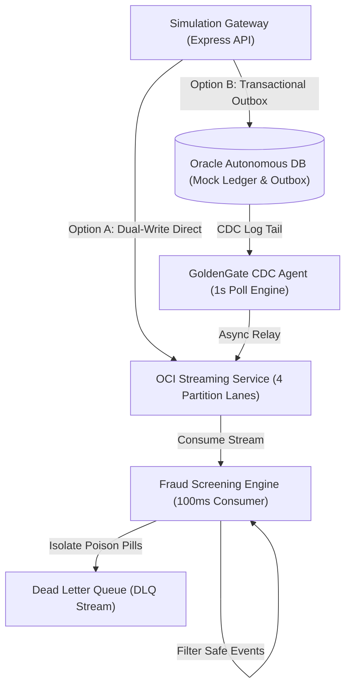

# OCI Data Engineering Sandbox: Hands-On Guide

Welcome to the **OCI Data Engineering & Transactional Resilience Sandbox**. This hands-on guide details the architectural concepts, code flows, and interactive walk-through steps for the exercises included in this module.

This sandbox simulates a modern enterprise banking gateway handling transactional events under standard operations, connection outages, and active pipeline faults (poison pills).

---

## 1. Architectural Overview

The simulation dashboard replicates an end-to-end data pipeline with five major components:



### Component Details
1. **Simulation Gateway (Express API)**: Exposes endpoints for client triggers, state inspection, stream management, and transaction execution.
2. **Oracle Autonomous DB (Mock Ledger & Outbox)**: Stores the bank ledger balance accounts and a transaction transaction-log table (`outbox`) inside a relational storage engine.
3. **GoldenGate CDC Agent**: Simulates an Oracle GoldenGate change data capture agent polling the `outbox` table in the background. It finds `PENDING` transactions and asynchronously relays them to OCI Streaming Service.
4. **OCI Streaming Service (OSS)**: A Kafka-compatible messaging stream partitioned deterministically using a partition key (`hashCode(accountId) % 4`).
5. **Fraud Screening Consumer Engine**: Polling thread simulating a consumer node that evaluates streaming messages for format conformity, business rules, schema constraints, and blacklist checks.
6. **Dead Letter Queue (DLQ)**: A separate queue/topic designed to isolate pipeline "poison pills" safely without stopping the processing pipeline.

---

## 2. Getting Started

### Prerequisites
- Node.js (version 18 or higher) Installed.

### Installation
From the root repository directory, navigate to the `Data Engineering` folder and install dependencies:

```bash
cd "Data Engineering"
npm install
```

### Running the Simulator
To run the web interface locally:
```bash
node server.js
```
The console will display:
`[Simulation Gateway] Running on http://localhost:3000`

Open your web browser and navigate to: **[http://localhost:3000](http://localhost:3000)**

---

## 3. Hands-On Exercises

---

### Exercise 1: Non-Blocking Event Ingestion & Message Ordering

#### **Conceptual Background**
High-throughput gateways should process event ingestions asynchronously. When an client posts an event, the broker returns an immediate `HTTP 202 Accepted` status acknowledging write receipt without waiting for downstream consumption or synchronous processing.
To maintain strict message sequence across accounts (e.g., balance updates must apply in the exact order they occurred), events are pinned to specific streaming partitions using a partition key—in this case, the `accountId`.

#### **Step-by-Step Interactive Walkthrough**
1. Open the UI dashboard. Locate the **Exercise 1 Panel** at the top.
2. Select an **Account Target** (e.g., `ACC-1001 (Alpha Corp)`).
3. Set an **Amount** and transaction **Type** (e.g. `DEBIT`).
4. Click the **Fire Parallel Transaction Stream (5x Events)** button.
5. In the **Gateway Ingestion Telemetry** terminal pane:
   * Observe five immediate acknowledgments showing: `Gateway HTTP 202 Accepted. Event env_xxx assigned deterministically to Partition X`.
6. Inspect the **Partitions Visualizer** lanes:
   * Notice that all five events for the chosen account are placed in the exact same partition lane (e.g., Partition 1 for `ACC-1001`, Partition 3 for `ACC-1002`, etc.) in sequential order of their sequence numbers.

#### **Under-the-Hood Code Flow**
- **API Endpoint:** `POST /api/stream/inject`
- **Key-Partitioning Formula:**
  ```javascript
  function getPartition(accountId) {
    if (!accountId) return 0;
    let hash = 0;
    for (let i = 0; i < accountId.length; i++) {
      hash = accountId.charCodeAt(i) + ((hash << 5) - hash);
    }
    return Math.abs(hash) % 4; // 4 Partition lanes
  }
  ```
- **Resulting Deterministic Key Mapping:**
  * `ACC-1004` $\rightarrow$ **Partition 0**
  * `ACC-1001` $\rightarrow$ **Partition 1**
  * `ACC-1003` $\rightarrow$ **Partition 2**
  * `ACC-1002` $\rightarrow$ **Partition 3**

#### **Self-Verification Checklist**
- [ ] Were 5 parallel events generated instantly?
- [ ] Did the HTTP response return immediately (non-blocking)?
- [ ] Did all events for a single account target end up in the **same** partition lane?

---

### Exercise 2: Transactional Outbox Pattern vs. Dual-Write Atomicity

#### **Conceptual Background**
A common microservices anti-pattern is **Dual-Writing**, where a service updates a database and immediately publishes an event to a stream in the same request handler. If the streaming broker suffers temporary downtime, the database update might succeed while the streaming event fails (causing data drift) or the database transaction must abort due to the downstream failure.
The **Transactional Outbox Pattern** solves this. Inside a single database transaction, the application updates the record AND writes an event metadata row to a dedicated `outbox` table. A background agent (CDC) polls the outbox and relays the events asynchronously, ensuring event delivery even during streaming broker outages.

```
[Dual-Write Option (Synchronous)]
Client ---> [DB Update] ---> [Stream Write] ---> Success (if online)
                             [Stream Fails] ---> Abort DB / Transaction Rollback!

[Transactional Outbox (Asynchronous)]
Client ---> Transaction { [DB Update] + [Outbox Table Insert] } ---> Success (Atomically committed)
                                 |
                          (Async Poll Agent)
                                 v
                        [Stream Write] ---> Complete
```

#### **Step-by-Step Interactive Walkthrough**

##### **Phase A: Testing Dual-Write Failure Mode**
1. Disconnect the stream engine by clicking the green **Stream Broker: ONLINE** button in the header. The button changes to red **Stream Broker: OFFLINE**.
2. Go to the **Exercise 2 Panel**. Select **Dual-Write (Sync Publish)** mode.
3. Select `ACC-1001 (Alpha Corp)` (Starting balance: `$5000.00`). Set the transaction amount to `$1000.00`, and select **DEBIT**.
4. Click **Commit Transaction**.
5. Inspect the telemetry logs and ledger table:
   * **Result:** The transaction aborts with an error: `Connection Timeout: Broker unreachable`.
   * **Verification:** The ledger balance for `ACC-1001` remains `$5000.00` because the transaction rolled back. No outbox log is created.

##### **Phase B: Testing Transactional Outbox Resilience**
1. Keep the **Stream Broker: OFFLINE**.
2. In the Exercise 2 Panel, switch the mode to **Transactional Outbox (CDC Async)**.
3. Select `ACC-1001`, keep the amount at `$500.00`, select **DEBIT**.
4. Click **Commit Transaction**.
5. Observe the ledger table and outbox log table:
   * **Result:** The ledger balance updates successfully to `$4500.00`.
   * **Outbox Status:** A new record is created in the **Oracle DB Outbox Log Table** with a status of `PENDING`.
   * **Agent Telemetry:** The GoldenGate CDC Agent panel shows status: `LAGGING (OFFLINE)` and logs: `[CDC Broker Timeout] Connection refused. Relays paused.`
6. Restore the stream broker by clicking the red **Stream Broker: OFFLINE** button (toggles back to **ONLINE**).
7. Watch the CDC Agent console and Outbox Log table:
   * **Result:** Within 1 second, the GoldenGate agent logs: `Relayed DB outbox event ID X to stream partition Y successfully.`
   * **Outbox Status:** The outbox row status transitions from `PENDING` to `PROCESSED`.

#### **Under-the-Hood Code Flow**
- **API Endpoint:** `POST /api/transaction`
- **Database Transaction Logic (`executeTransaction`):**
  ```javascript
  if (mode === 'dual_write') {
    // DUAL WRITE: Write to DB, immediately call stream
    const streamEnvelope = publishToStream('transaction-stream', eventPayload);
    return { ... };
  } else {
    // OUTBOX: Update balance and write outbox entry atomically
    const outboxEntry = {
      id: nextOutboxId++,
      accountId,
      eventType: 'TRANSACTION_COMMITTED',
      payload: JSON.stringify(eventPayload),
      status: 'PENDING',
      createdAt: Date.now()
    };
    outbox.push(outboxEntry);
    return { ... };
  }
  ```
- **CDC Relay Agent (`startCDCAgent`):**
  Runs every 1000ms. Scans `outbox` for `status === 'PENDING'`, publishes the payload, updates status to `PROCESSED`, and writes to `cdcRelayHistory`.

#### **Self-Verification Checklist**
- [ ] During Dual-Write with offline stream, did the transaction abort and roll back the balance to `$5000.00`?
- [ ] During Outbox Mode with offline stream, did the transaction succeed, changing the balance to `$4500.00`?
- [ ] Did the outbox table catch the record as `PENDING`?
- [ ] Upon turning the stream ONLINE, did the CDC agent automatically process the pending row and publish the event?

---

### Exercise 3: Advanced Pipeline Resilience & Poison Pill DLQ Isolation

#### **Conceptual Background**
A **Poison Pill** is a message that cannot be processed by a consumer due to serialization errors, missing fields, schema changes, or business rules violations. In a naive streaming pipeline, a poison pill will cause the consumer node to crash or block the offset queue, starving all subsequent messages.
To guarantee high availability, consumer nodes wrap message processing in exception handling logic. When a validation exception occurs, the consumer isolates the raw payload and details of the error, routes them to a **Dead Letter Queue (DLQ)** topic, advances the consumer offset, and immediately resumes reading next transactions.

#### **Step-by-Step Interactive Walkthrough**
1. Make sure the Stream Broker is **ONLINE**.
2. Locate the **Exercise 3 Panel** (Advanced Pipeline Resilience).
3. First, fire a safe transaction (e.g., using Exercise 1 or standard transfers) to see normal throughput flow.
4. Click **Inject Malformed JSON (Parsing Failure)**:
   * Simulates invalid string serialization.
5. Click **Inject Missing Routing Code (Schema Violation)**:
   * Simulates payload failing schema validations.
6. Click **Inject Negative Amount (Business Rule Exception)**:
   * Simulates incorrect transaction value payload validation.
7. Click **Inject Blacklisted Entity (Security Trap)**:
   * Simulates a security check catch on a flagged account (`ACC-CHAOS-VOID`).
8. View the **Pipeline Telemetry Dashboard**:
   * Observe the **DLQ Isolated Poison Pills** counter increase with each injection (should rise to `4`).
   * Observe **Clean Transactions Screened** and **Total Streams Ingested** metrics update.
9. Examine the **Dead Letter Queue (DLQ) Isolated Records Table**:
   * Inspect each quarantined record, reviewing the exact **Reason**, **Exception Type**, **Consumer Node**, and **Raw Corrupted Payload** preview.
   * Notice that the consumer engine did not crash and continues processing trailing clean transactions.

#### **Under-the-Hood Code Flow**
- **Consumer Processing Routine (`startConsumerEngine`):**
  ```javascript
  try {
    const payload = envelope.payload;
    let data = (typeof payload === 'string') ? JSON.parse(payload) : payload;

    // Validation Rules:
    if (!data || typeof data !== 'object') throw new SyntaxError('Message payload is not a valid JSON structure');
    if (!data.accountId) throw new Error('Schema Violation: Missing required routing attribute "accountId"');
    if (typeof data.amount !== 'number' || isNaN(data.amount)) throw new Error('Schema Violation: Missing or invalid "amount" property');
    if (data.amount <= 0) throw new Error('Business Rule Violation: Non-positive transaction amount');
    if (!data.routingCode || !/^[A-Z0-9-]+$/.test(data.routingCode)) throw new Error('Schema Violation: Invalid or corrupted "routingCode" format');
    if (data.accountId === 'ACC-CHAOS-VOID') throw new Error('Security Exception: Blacklisted Account Entity Identified');

    cleanProcessedCount++;
  } catch (error) {
    // Quarantine poison pill to DLQ topic
    const dlqPacket = {
      rawEnvelope: envelope,
      errorReason: error.message,
      exceptionClass: error.constructor.name,
      isolatedAt: Date.now(),
      consumerNodeId: 'fraud-screener-node-01'
    };
    publishToStream('dlq-stream', dlqPacket);
    dlqHistory.push(dlqPacket);
  }
  ```

#### **Self-Verification Checklist**
- [ ] Did the DLQ counter increase exactly to 4 when all four poison pills were sent?
- [ ] Does the DLQ table display the specific exception message (e.g. `Blacklisted Account Entity Identified`, `SyntaxError`)?
- [ ] If you fire a clean transaction after the poison pills, is it still processed successfully (verifying consumer node is still alive)?

---

## 4. Running the Automated CLI Verification Test

The repository includes a comprehensive CLI test runner script that verifies the operational mechanics of all three exercises programmatically using a headless server environment.

To run the automated tests:
```bash
node test_runner.js
```

> [!WARNING]
> **Port Conflict Collision (`fetch failed`):**
> The test runner tries to start its own background server instance on port `3000`. If you already have `node server.js` running in another terminal window or background process, the test runner will fail to bind to the port and abort with a `fetch failed` error.
> 
> To resolve this, stop any active running servers (using `Ctrl+C` in your server terminal or killing the node process) before running `node test_runner.js`.

### What the test runner does:
1. Spawns the simulation server background process.
2. Resets the simulation database and stream tables.
3. **Asserts Exercise 1:** Dispatches parallel messages for `ACC-1001` & `ACC-1002`, verifying deterministic key-partitioning pinning.
4. **Asserts Exercise 2:** Switches stream offline, performs a Dual-Write transaction (verifies rollback), performs an Outbox transaction (verifies pending outbox table insertion), sets stream online, and verifies CDC relay event.
5. **Asserts Exercise 3:** Injects all four poison pill types, waits for the consumer loop, and verifies that the DLQ count is exactly 4 and consumer has quarantined all errors safely.
6. Kills the background server process and prints a `100% PASS RATE` summary.
